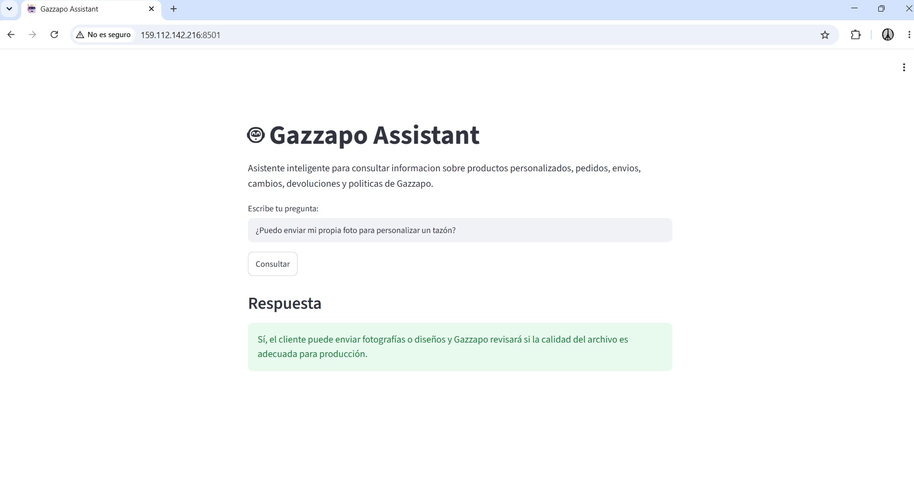

# 🤖 Gazzapo Assistant — AluraAgente Challenge

## Asistente inteligente con RAG para atención al cliente

Proyecto desarrollado para el Challenge **Alura Agente - Oracle Next Education (ONE)**.

Gazzapo Assistant es un agente de Inteligencia Artificial capaz de responder preguntas sobre productos personalizados, pedidos, envíos, cambios, devoluciones y políticas de atención utilizando información contenida en un documento PDF.

El proyecto utiliza una arquitectura **RAG (Retrieval-Augmented Generation)** para recuperar información relevante del documento antes de generar una respuesta.

---

## 🎯 Problema que resuelve

Los clientes de una tienda de productos personalizados pueden tener preguntas frecuentes como:

- ¿Puedo enviar mi propia fotografía?
- ¿Cuánto demora un pedido?
- ¿Qué pasa si mi producto llega dañado?
- ¿Puedo cambiar un producto personalizado?
- ¿Cómo se realizan los despachos?
- ¿Qué ocurre si envié información incorrecta?

Buscar manualmente cada respuesta consume tiempo.

**Gazzapo Assistant** automatiza este proceso utilizando Inteligencia Artificial y una base de conocimiento documental.

---

## 🧠 ¿Cómo funciona?

El sistema utiliza una arquitectura RAG:

```text
Usuario
   |
   v
Interfaz Streamlit
   |
   v
Pregunta
   |
   v
Embeddings
sentence-transformers/all-MiniLM-L6-v2
   |
   v
Búsqueda semántica con FAISS
   |
   v
Fragmentos relevantes del PDF
   |
   v
Gemma 3 mediante Ollama
   |
   v
Respuesta basada en el documento
```

El modelo recibe únicamente los fragmentos relevantes recuperados desde la base vectorial, reduciendo respuestas que no estén respaldadas por el documento.

---

## 📄 Base de conocimiento

El agente utiliza:

```text
documentos/manual_gazzapo_challenge.pdf
```

El documento contiene información sobre:

- Preguntas frecuentes.
- Productos personalizados.
- Pedidos y aprobación de diseños.
- Envíos y entregas.
- Cambios y devoluciones.
- Privacidad.
- Términos básicos del servicio.

---

## 🛠 Tecnologías utilizadas

- Python
- Streamlit
- LangChain
- Ollama
- Gemma 3 270M
- Hugging Face Embeddings
- sentence-transformers/all-MiniLM-L6-v2
- FAISS
- PyPDF
- Git
- GitHub
- Oracle Cloud Infrastructure

---

## 📂 Estructura del proyecto

```text
aluragente-challenge/
│
├── agentes/
│   ├── agente.py
│   └── respuesta_ia.py
│
├── documentos/
│   └── manual_gazzapo_challenge.pdf
│
├── utils/
│   └── lector_pdf.py
│
├── app.py
├── streamlit_app.py
├── requirements.txt
├── README.md
└── .gitignore
```

---

## 🔎 Procesamiento del documento

El PDF es leído mediante PyPDF.

Posteriormente, el contenido se divide en fragmentos utilizando:

```text
RecursiveCharacterTextSplitter
```

Configuración:

```text
chunk_size = 500
chunk_overlap = 50
```

Los embeddings se generan utilizando:

```text
sentence-transformers/all-MiniLM-L6-v2
```

Los vectores se almacenan y consultan mediante **FAISS**.

---

## 🤖 Modelo de Inteligencia Artificial

El proyecto utiliza **Gemma 3 mediante Ollama**.

Modelo configurado:

```text
gemma3:270m
```

Se eligió una versión ligera para permitir la ejecución del agente en una instancia de recursos limitados en Oracle Cloud.

---

## ⚙️ Instalación

### 1. Clonar el repositorio

```bash
git clone https://github.com/zombie75/aluragente-challenge.git
cd aluragente-challenge
```

### 2. Crear entorno virtual

```bash
python -m venv venv
```

Linux/macOS:

```bash
source venv/bin/activate
```

Windows:

```bash
venv\Scripts\activate
```

### 3. Instalar dependencias

```bash
pip install -r requirements.txt
```

### 4. Instalar Ollama

Descargar e instalar Ollama desde su sitio oficial.

Después descargar el modelo:

```bash
ollama pull gemma3:270m
```

---

## ▶️ Ejecutar la aplicación

```bash
streamlit run streamlit_app.py
```

Por defecto estará disponible en:

```text
http://localhost:8501
```

Para permitir conexiones externas:

```bash
streamlit run streamlit_app.py --server.address 0.0.0.0 --server.port 8501
```

---

## 💬 Ejemplos de preguntas

### ¿Puedo enviar mi propia foto para personalizar un tazón?

El agente recupera la información relacionada desde el PDF y explica que el cliente puede enviar fotografías o diseños y que se revisará la calidad del archivo antes de la producción.

### ¿Qué pasa si mi pedido llega con un nombre equivocado?

El agente consulta las políticas de productos personalizados y determina la respuesta utilizando la información recuperada del documento.

### ¿Cuánto demora un pedido?

El agente consulta las políticas de producción y entrega incluidas en la base de conocimiento.

---

## ☁️ Despliegue en Oracle Cloud

La aplicación fue desplegada en una instancia Ubuntu de **Oracle Cloud Infrastructure (OCI)**.

En el servidor se ejecutan:

```text
Streamlit
   +
FAISS
   +
Hugging Face Embeddings
   +
Ollama
   +
Gemma 3
```

Streamlit está configurado como un servicio de `systemd`, permitiendo que la aplicación continúe ejecutándose aunque se cierre la sesión SSH.

Ollama también funciona como servicio del sistema.

---

## ⚡ Optimización

Para reducir la carga del servidor, la memoria vectorial se mantiene en caché mediante:

```python
@st.cache_resource
```

Esto evita reconstruir los embeddings y el índice FAISS en cada interacción del usuario.

---

## 🔐 Principio de respuesta

El agente recibe instrucciones para responder utilizando exclusivamente la información recuperada desde el documento.

Cuando el contexto no contiene información relacionada, debe indicar:

```text
No encontré esa información en el documento.
```

---

## 🚀 Resultado

El proyecto demuestra la construcción de un agente inteligente capaz de:

- Leer documentos PDF.
- Dividir y procesar texto.
- Crear embeddings.
- Construir una memoria vectorial.
- Realizar búsquedas semánticas.
- Implementar RAG.
- Consultar un LLM local.
- Generar respuestas basadas en contexto.
- Proporcionar una interfaz web.
- Desplegar una aplicación de IA en la nube.
## ☁️ Evidencia del Deploy en Oracle Cloud

Gazzapo Assistant fue desplegado y se encuentra funcionando en una instancia Ubuntu de Oracle Cloud Infrastructure (OCI).

**Aplicación desplegada:**

http://159.112.142.216:8501

### Aplicación funcionando en OCI



### Ejemplo real

**Pregunta:**

¿Puedo enviar mi propia foto para personalizar un tazón?

**Respuesta generada:**

Sí, el cliente puede enviar fotografías o diseños y Gazzapo revisará si la calidad del archivo es adecuada para producción.

La respuesta se obtiene utilizando información recuperada desde el documento `manual_gazzapo_challenge.pdf` mediante la arquitectura RAG.


---

## 👨‍💻 Autor

Carlos Martínez

Challenge Alura Agente  
Oracle Next Education — ONE
