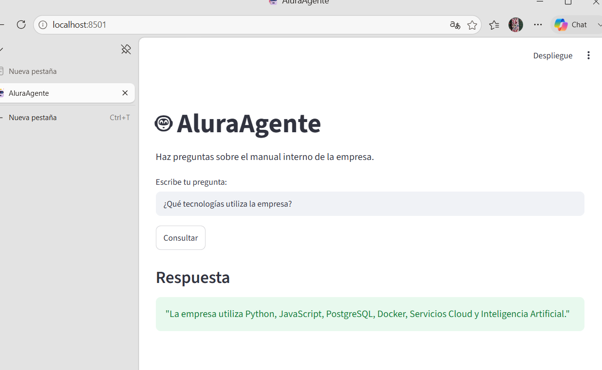

# 🤖 AluraAgente Challenge

## Agente de Inteligencia Artificial para consulta de documentos empresariales

Proyecto desarrollado para el Challenge **Alura Agente - Oracle Next Education**, cuyo objetivo es construir un agente de Inteligencia Artificial capaz de responder preguntas sobre documentos internos de una empresa utilizando técnicas de **RAG (Retrieval-Augmented Generation)**.

La aplicación permite cargar un documento PDF empresarial, procesar su contenido, crear una memoria vectorial y responder consultas en lenguaje natural utilizando un modelo de lenguaje local.

---

# 📌 Descripción del Proyecto

Muchas empresas almacenan grandes cantidades de información en documentos internos como:

- Manuales corporativos.
- Políticas internas.
- Procedimientos.
- Documentación técnica.
- Informes.

Buscar información manualmente consume tiempo.

Este proyecto implementa un asistente inteligente capaz de:

✅ Leer documentos PDF.  
✅ Procesar información relevante.  
✅ Crear embeddings del contenido.  
✅ Buscar información mediante similitud semántica.  
✅ Generar respuestas utilizando Inteligencia Artificial.

---

# 🏗 Arquitectura del Proyecto

La arquitectura utilizada corresponde a un sistema **RAG (Retrieval-Augmented Generation)**.

```
Usuario
   |
   ↓
Interfaz Streamlit
   |
   ↓
Pregunta del usuario
   |
   ↓
Búsqueda semántica FAISS
   |
   ↓
Embeddings Hugging Face
   |
   ↓
Fragmentos relevantes del documento
   |
   ↓
Modelo Gemma 3 (Ollama)
   |
   ↓
Respuesta generada por IA
```

---

# 🛠 Tecnologías Utilizadas

## Lenguaje

- Python 3

## Inteligencia Artificial

- Ollama
- Gemma 3
- LangChain
- Hugging Face Embeddings

## Procesamiento de documentos

- PyPDF

## Base vectorial

- FAISS

## Interfaz

- Streamlit

## Control de versiones

- Git
- GitHub

---

# 📂 Estructura del Proyecto

```
aluragente-challenge/

│
├── agentes/
│   ├── agente.py
│   └── respuesta_ia.py
│
├── documentos/
│   └── manual_empresa.pdf
│
├── utils/
│   └── lector_pdf.py
│
├── app.py
│
├── streamlit_app.py
│
├── requirements.txt
│
├── README.md
│
└── .gitignore
```

---

# ⚙️ Instalación

## 1. Clonar repositorio

```bash
git clone https://github.com/zombie75/aluragente-challenge.git
```

Entrar al proyecto:

```bash
cd aluragente-challenge
```

---

## 2. Crear entorno virtual

Windows:

```bash
python -m venv venv
```

Activar:

```bash
venv\Scripts\activate
```

---

## 3. Instalar dependencias

```bash
pip install -r requirements.txt
```

---

# 🤖 Configuración del Modelo IA

Este proyecto utiliza Ollama para ejecutar Gemma localmente.

Instalar Ollama:

https://ollama.com/

Descargar modelo:

```bash
ollama pull gemma3:1b
```

Ejecutar modelo:

```bash
ollama run gemma3:1b
```

---

# ▶️ Ejecutar Aplicación

Ejecutar:

```bash
streamlit run streamlit_app.py
```

La aplicación estará disponible en:

```
http://localhost:8501
```

---

# 💬 Ejemplos de Preguntas

## Pregunta

```
¿Qué tecnologías utiliza la empresa?
```

Respuesta:

```
La empresa utiliza Python, JavaScript,
PostgreSQL, Docker, Servicios Cloud
e Inteligencia Artificial.
```

---

## Pregunta

```
¿Cuál es el horario laboral?
```

Respuesta:

```
Lunes a viernes de 09:00 a 18:00 horas.
```

---

## Pregunta

```
¿Qué hace el área de tecnología?
```

Respuesta:

```
Desarrolla aplicaciones web, APIs y soluciones
basadas en inteligencia artificial.
```

---

# 🧠 Conceptos Aplicados

Este proyecto implementa:

- Procesamiento de lenguaje natural.
- Embeddings.
- Bases de datos vectoriales.
- Búsqueda semántica.
- Modelos de lenguaje.
- Arquitectura RAG.

---

# 🚀 Próximas Mejoras

- Implementación en Oracle Cloud Infrastructure (OCI).
- Soporte para múltiples documentos.
- Autenticación de usuarios.
- Historial de conversaciones.
- Panel administrativo.

---

# 👨‍💻 Autor

**Carlos Martínez**

Analista Programador  

GitHub:

https://github.com/zombie75

---

# 📄 Challenge

Proyecto desarrollado como parte del programa:

**Oracle Next Education - Alura Latam**

Challenge:
**Alura Agente - Construcción de un Agente de IA**

---

# 📸 Demostración del Agente funcionando

La aplicación permite realizar preguntas sobre documentos empresariales
y obtener respuestas mediante Inteligencia Artificial.



---